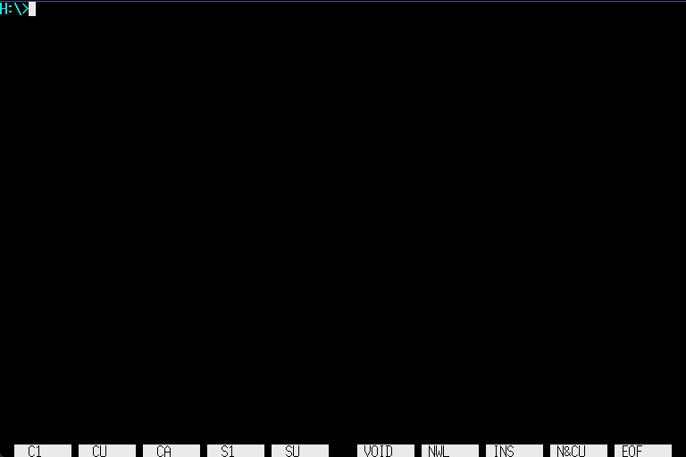

# Linux for X68000

MC68000搭載のX68000で、MMUを使わないLinux（uClinux）を動かすプロジェクトです。Human68k上から起動し、Linuxのシェルやアプリケーションを利用したあと、Human68kへ戻れます。

ストレージへのアクセスには常駐するHuman68kのDOSコールを使います。Linux側からHuman68kのドライブを読み書きでき、そこに置いたHuman68kの`.X`プログラムも実行できます。



## 動作環境

- MC68000搭載のX68000。X68030など、68000以外のCPUを搭載した機種は対象外です。
- メモリ6MB以上が目安です。利用できるメモリはHuman68kや常駐ソフトの使用量にも左右されます。
- Human68kから読み書きできるストレージ。

10MHz機では起動やコマンドの実行に時間がかかります。標準構成はキーボードとテキストコンソールを使う環境で、ネットワークは有効にしていません。

## 起動する

[リリースアーカイブ](https://github.com/yunkya2/linux-x68k/releases)から、次の3ファイルをHuman68k上の同じディレクトリに配置します。

| ファイル | 役割 |
| --- | --- |
| `linux.x` | Human68k用のLinuxローダー |
| `linux.sys` | 起動用initramfsを内蔵したLinuxカーネル |
| `linuxroot.img` | ユーザランドを収録した、書き込み可能なルートファイルシステムイメージ |

Human68kのコマンドラインで実行します。

```text
linux.x
```

カーネルの起動後、`linuxroot.img`をループデバイスとしてマウントし、その中の`/init`へ切り替えます。`/init`が各ファイルシステムをマウントすると、ログイン操作なしでシェルが起動します。

### ローダーのオプション

```text
linux.x [-k kernel] [-r rootfs] [-f free-memory] [--] [kernel-arguments...]
```

| オプション | 内容 | 省略時 |
| --- | --- | --- |
| `-k kernel` | 読み込むカーネルのパス | `linux.x`と同じディレクトリの`linux.sys` |
| `-r rootfs` | ルートファイルシステムイメージのHuman68k上のパス | `linux.x`と同じディレクトリの`linuxroot.img` |
| `-f free-memory` | Linuxへ割り当てず、Human68k側に残す空きメモリ量 | `256K` |
| `--` | ローダーのオプションを終了し、以降をカーネルへ渡す | — |

`-f`は10進数のバイト数、または`K`・`M`付きの値を受け付けます（大文字・小文字どちらも可）。Human68kのプログラムを実行するための空きメモリが足りない場合は、この値を増やします。その分Linuxで使えるメモリは減ります。

ローダーのオプションはカーネル引数より前に指定してください。最初のオプション以外の引数、または`--`以降はカーネル引数として扱います。

```text
linux.x -f 512K
linux.x -k linux2.sys -r C:\LINUX\root2.img
linux.x fsck
linux.x -- init=/bin/sh
```

起動時に使える主な引数は次のとおりです。

| 引数 | 動作 |
| --- | --- |
| `fsck` | ルートイメージを使用する前に`e2fsck`で検査します。イメージ内の`/sbin/e2fsck`が必要です。 |
| `init=/path` | ルートイメージへ切り替えた後に実行するプログラムを指定します。標準は`/init`です。 |
| `rdinit=/bin/sh` | 起動用initramfs内のシェルを起動します。ルートイメージへの切り替え前の調査用です。 |

`init=/bin/sh`では通常の`/init`によるマウント処理や終了処理を省略します。普段は引数なしで起動してください。

ローダーはイメージのパスを`rootfs_image=`、確保したメモリの終端を`ramend=`として自動的に渡します。通常、これらを手動で指定する必要はありません。カーネルへの引数は自動追加分を含めて255バイトまでです。ルートイメージのパスには空白を含めないでください。

## Linuxを使う

### ファイルとコマンド

標準ユーザランドにはBusyBox、e2fsprogs、Micro Emacs（uemacs）、[Rogue](https://github.com/leopard-gecko/homebrew-game)を収録しています。CライブラリはuClibcを使用します。

`/`への変更は`linuxroot.img`に保存されます。Human68kのドライブは`humanfs`経由で`/mnt`以下に現れます。例えばCドライブは`/mnt/c`です。表示されるのはメディアが挿入されているドライブです。

```sh
ls /mnt
ls /mnt/c
cp /etc/profile /mnt/c/profile.txt
```

`humanfs`への書き込みは、Human68k側のファイルを直接変更します。

### Human68kのプログラムを実行する

`humanfs`上の`.X`または`.x`ファイルを、Linuxのシェルからパスを指定して実行できます。例えばCドライブのルートに`COMMAND.X`がある場合は、次のように起動します。

```sh
/mnt/c/COMMAND.X
```

実行はHuman68kのDOSに委譲され、プログラムの終了後はLinuxへ戻ります。この機能は`humanfs`上のX形式実行ファイルが対象です。`linuxroot.img`内へコピーした`.X`ファイルは対象になりません。

### 終了する

通常はシェルで`exit`を実行するか、空の入力行でCtrl-Dを押します。標準の`/init`はシェル終了後にルートファイルシステムを読み取り専用で再マウントしてから終了し、Human68kへ戻ります。

InterruptスイッチやバスエラーなどでもHuman68kへ戻りますが、通常の終了処理を通りません。書き込み中に中断した場合などは、次回の起動で`linux.x fsck`を指定してイメージを検査してください。

## ソースからビルドする

### 準備

ビルド環境はUbuntu 24.04で確認しています。以下を用意してください。

- Git、GNU Make、ホスト用C/C++コンパイラ、Python 3など、[Buildrootのビルドに必要なツール](buildroot/docs/manual/prerequisite.adoc)。設定画面を使う場合はncursesの開発用ライブラリも必要です。
- [Human68k用クロス開発環境](https://github.com/yunkya2/elf2x68k.git)。`m68k-xelf-gcc`が`PATH`にあり、`x68k/dos.h`および`nano.specs`を利用できることが必要です。これは`linux.x`のビルドに使い、このリポジトリの`make sdk`では生成しません。
- 初回ビルドでBuildrootがソースを取得するためのネットワーク接続。

```sh
git clone --recursive https://github.com/yunkya2/linux-x68k.git
cd linux-x68k
make everything
```

すでにclone済みでサブモジュールを取得していない場合は、先に`git submodule update --init --recursive`を実行します。

`make everything`は次の順に処理します。

1. Linux用クロスツールチェーンSDKをビルドし、`toolchain/`へ展開・再配置する。
2. 起動用initramfsをビルドし、`toolchain/initroot.cpio`へ保存する。
3. 通常ユーザランドとカーネルにX68000用の標準設定を適用する。
4. `linux.x`、`linux.sys`、`linuxroot.img`を生成する。

SDK、initramfs、通常ユーザランドには、それぞれ`buildroot/output-sdk`、`buildroot/output-init`、`buildroot/output`を使用します。カーネルの出力先は`linux/build`です。標準のルートイメージは6MiBのext2形式で、カーネルのext4ドライバーで扱います。

### 変更後のビルド

一度全体をビルドした後は、通常は`make`で更新できます。既存のSDKとinitramfsを使い、ユーザランド・カーネル・ローダーの変更を反映します。

| コマンド | 用途 |
| --- | --- |
| `make` / `make all` | 3つの配布用ファイルを更新 |
| `make linux` | カーネルと`linux.sys`を更新 |
| `make buildroot` | 通常ユーザランドを更新。出力は`buildroot/output/images/rootfs.ext2` |
| `make linuxroot.img` | 通常ユーザランドをビルドし、トップディレクトリのイメージへ反映 |
| `make initroot` | 既存SDKで起動用initramfsを作り直す |
| `make sdk` | Linux用SDKを作り直して再インストール |
| `make busybox-rebuild` | 通常ユーザランドのBusyBoxを再ビルド |
| `make clean` | トップディレクトリの生成物を削除。SDK・initramfs・サブディレクトリのビルド出力は保持 |
| `make help` | 主なターゲットを表示 |

通常ユーザランドだけを変更した場合、カーネルの作り直しは不要です。`make buildroot`や`make busybox-rebuild`の後は、`make`または`make linuxroot.img`で配布用イメージへ反映します。起動用initramfsを変更した場合は、`make initroot`の後に`make linux`でカーネルへ取り込みます。

`make everything`はSDKとinitramfsを作り直し、通常ユーザランドとカーネルの設定も標準設定に戻します。設定を調整した後の普段のビルドには`make`を使ってください。

### 設定を変更する

| 対象 | 設定画面 | 設定の保存 | 保存先 |
| --- | --- | --- | --- |
| カーネル | `make linux-menuconfig` | `make linux-savedefconfig` | `linux/arch/m68k/configs/x68k_defconfig` |
| 通常ユーザランド | `make buildroot-menuconfig` | `make buildroot-savedefconfig` | `buildroot/configs/x68k_defconfig` |
| 通常ユーザランドのBusyBox | `make busybox-menuconfig` | `make busybox-update-config` | `buildroot/package/busybox/busybox.config` |

SDKの標準設定は`buildroot/configs/x68k_sdk_defconfig`、起動用initramfsの標準設定は`buildroot/configs/x68k_init_defconfig`です。起動用BusyBoxは`buildroot/package/busybox/busybox-init.config`を使います。

## エミュレータ用のディスクイメージを作る

ビルド環境に加えて、次のファイルとツールを用意します。Human68k関連ファイルはリポジトリには含まれていません。

- トップディレクトリに`HUMAN302.LZH`と`HIOCS.X`。
- `PATH`上に`unlha.py`(elf2x68kに同梱)と [xdftool.py](https://github.com/yunkya2/x68kmisc/tree/main/xdftool)

```sh
make hdf
```

`hdf/`を作り直してHuman68kのアーカイブを展開し、`HIOCS.X`とLinuxの3ファイルを配置した`linux-x68k.hdf`を生成します。生成したイメージから起動すると、`AUTOEXEC.BAT`が`linux.x`を実行します。ディスク作成ツールは`make hdf XDFTOOL=/path/to/xdftool.py`で変更できます。

`make release`はHDFの作成に加えて、3つの配布用ファイルを`linux-x68k-<gitのバージョン記述>.zip`にまとめます。HDF自体はこのZIPに含めません。

## 実装とソースの構成

| 場所 | 内容 |
| --- | --- |
| [linux.c](linux.c) | Human68k用ローダー。空きメモリを確保し、8192バイト境界へカーネルをロード |
| [elf2x68k.py](elf2x68k.py) | カーネルのELFを、再配置情報付きのHuman68k X形式へ変換。`linux.sys`の実体はX形式 |
| [linux/](linux/) | X68000対応のLinuxカーネル（サブモジュール） |
| [buildroot/](buildroot/) | ツールチェーンとユーザランドを構築するBuildroot（サブモジュール） |
| [buildroot/fs/cpio/init](buildroot/fs/cpio/init) | 起動用initramfsの`/init`。イメージの検査・マウントとルートの切り替え |
| [buildroot/board/x68k/x68k/rootfs_overlay/init](buildroot/board/x68k/x68k/rootfs_overlay/init) | 通常ルートの`/init`。ファイルシステムのマウント、シェル起動、終了処理 |
| [Makefile](Makefile) | 全体のビルドと配布物の生成 |

標準構成ではMFP Timer-Cによるtick処理、MFP USARTによるJISキーボード入力、IOCSテキストコンソール、Human68kのDOSコールによる`humanfs`を使用します。起動初期のシリアル・IOCS出力は`CONFIG_X68K_EARLY_CONSOLE`で有効にできます。

10MHz機でtick処理が初期化処理を圧迫しないよう、`CONFIG_X68K_LEGACY_TICK_DIVISOR`の標準値を10とし、タイマー割り込み10回に1回tick処理を呼び出します。また、68000でアドレスエラーを起こす非整列アクセスを生成しないよう、Buildroot側のGCCにアラインメント対応のパッチを適用しています。

## 謝辞

- [Atari Jaguar用Linux](https://cakehonolulu.github.io/linux-for-jaguar/)を参考に開発しました。開発者のcakehonolulu氏に感謝します。
- 収録したRogueは[こちら](https://github.com/leopard-gecko/homebrew-game)から入手したmacOS用ソースコードをuClinuxで動作するよう修正したものです。配布されているleopard-gecko氏に感謝します。
