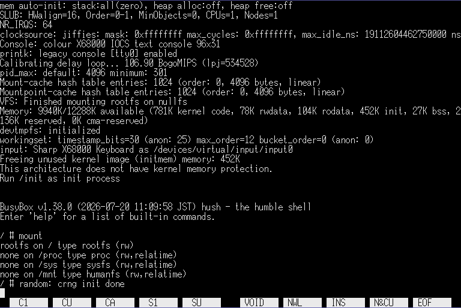

# Linux for X68000

## 概要

これはX68000でLinuxを動かすプロジェクトです。

68000にはMMUが搭載されていませんが、本プロジェクトではMMUを使用しない組み込み向けLinux(uClinux)を使用します。



## 起動方法

- [リリースアーカイブ](https://github.com/yunkya2/linux-x68k/releases)内の `loader.x` と `vmlinux.bin` をHuman68k上で同じディレクトリに置き、 `loader.x` を実行してください
- gzip圧縮したカーネルも `loader.x vmlinux.bin.gz` のようにファイル名を指定して起動できます
- しばらく待つとLinuxカーネルが起動し、シェルプロンプトが表示されます
  - シェルプロンプトが出るまで、10MHz機で1分半ほどかかります。気長に待ってください
  - キーボードはUS配列になっています
- 起動すると本体の電源スイッチが効かなくなります。電源を切る際は一度リセットしてください

## 制約事項

- X68000専用です。X68030など68000以外のCPUを搭載した機種では動作しません
- 起動には最低6MBのメモリが必要です

## ビルド方法

ビルドはUbuntu-24.04でのみ確認しています。

ソースコードリポジトリを`--recursive`オプション付きでclone後、
```
make everything
```
でtoolchainやユーザランドを含めた全てのビルドが行えます。

一度ビルドした後は、以下のコマンドでビルド構成を変更できます。

- `make linux` : Linuxカーネルの再ビルド (ユーザランドを変更した場合の取り込み)
- `make linux-menuconfig` : Linuxカーネルの設定変更
- `make linux-savedefconfig` : 変更したconfigの保存 (`linux/arch/m68k/configs/x68k_defconfig`に保存されます)
- `make buildroot` : ユーザランドの再ビルド
- `make buildroot-menuconfig` : ユーザランドの設定変更
- `make buildroot-savedefconfig` : ユーザランドの設定変更の保存 (`buildroot/configs/x68k_defconfig`に保存されます)
- `make busybox` : busyboxの再ビルド
- `make busybox-menuconfig` : busyboxの設定変更
- `make busybox-update-config` : busyboxの設定変更の保存 (`buildroot/package/busybox/busybox-minimal.config`に保存されます)

## 色々

- 以下のデバイスのみサポートしています
  - MFP Timer-C (tick timer)
  - MFP USART (キー入力)
  - カーネルデバッグコンソール出力
  - グラフィックVRAMによるフレームバッファコンソール
    - Linux kernelのsimple framebufferはX68000のテキストVRAMのようなプレーン形式をサポートしていないため、グラフィック画面をコンソール出力に使用しています
    - simple framebufferが対応しているピクセルフォーマットは(MSB側から見て)RGBの並びですがX68000はGRBの順に並んでいるため、カラーパレットを用いてRとGを入れ替えています
- Linuxカーネルはアドレス 0x004000- に配置されます
  - Human68k上のローダーはmalloc()で確保した領域に一旦ロードした後、0x004000-にコピーしてからジャンプします
- ユーザランドのCライブラリにはuClibcを使用しています
  - gccを`m68k-uclinux-uclibc`というターゲットでビルドしていますが、このターゲットでgccを作るとCPU種別に関係なくunaligned accessが可能な設定でコードが出力されてしまうため、68000で実行するとアドレスエラーが発生してしまいます。これを修正するための[パッチ](https://github.com/yunkya2/buildroot/commit/3d4d43fa887fcd5f42927d5c2869d8c9df79d8d2)をbuildrootに追加しています
- X68k版では100HzのTimer-C割り込みでタスクスケジューリングを行っていますが、10MHz機だとその処理が終わる前に次の割り込み周期が来てしまい、起動中に初期化処理が先に進まなくなってしまいます。このため、tick処理の呼び出し周期を下げるためのオプション (`CONFIG_X68K_LEGACY_TICK_DIVISOR`) を追加し、割り込み10回に1回だけtick処理を呼び出すようにしています。

## 謝辞

X68000用Linuxは、[Atari Jaguar用Linux](https://cakehonolulu.github.io/linux-for-jaguar/)を参考に開発しました。
開発者のcakehonolulu氏に感謝します。
